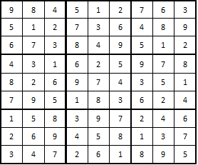

# Sudoku-solver
# Домашнее задание по дисциплине: “Алгоритмы и структуры данных”

Формулировка задания: “Написать программу для решения судоку” 

Выбранный язык программирования:  С++.

## Содержание

* [Теоретическая часть](#theoretical)

* * [Алгоритмы](#algorithms)

* * [Судоку - NP-полная задача](#np_complete)

* [Практическая часть](#practical)

* [Список использованных источников](#lit)

## Теоретическая часть

Поле судоку представляет собой таблицу 9х9 клеток. В каждую клетку заносится цифра от 1 до 9. Цель игры: расположить цифры таким образом, чтобы в каждой строке, в каждом столбце и в каждом блоке 3х3 не было повторений. Другими словами, в каждом столбце, строке и блоке должны быть все цифры от 1 до 9.

Существует множество подходов к решению задачи судоку. 

### Как решать простые судоку?

Рассмотрим на конкретном примере как разгадывать судоку. Игровое поле на картинке представляет собой относительно простой вариант игры. Правила игры судоку для простых сводятся к выявлению зависимостей в горизонтальной и вертикальной плоскости и в отдельных квадратах. 

Например, в центральной вертикали не хватает цифр 3, 4, 5. Четверка не может находиться в нижнем квадрате, так как в нем уже присутствует. Также можно исключить пустую центральную клетку, так как мы видим 4 в горизонтальной линии. Из этого делаем вывод, что она располагается в верхнем квадрате. Аналогично можем проставить 3 и 5 и получить следующий результат. 

Проведя линии в верхнем среднем малом квадрате 3х3 можно исключить ячейки, в которых не может находиться цифра 3. 

Продолжая разгадывать подобным образом, необходимо заполнить оставшиеся ячейки. В результате получается единственно верное решение.

Такой метод некоторые называют «Последний герой» или «Одиночка». Он также используется в качестве одного из нескольких на мастерских уровнях. Среднее время, затрачиваемое на простой уровень сложности, колеблется около 20 минут.

### Как решать сложные судоку? 

Многие задаются вопросом, как решать судоку, есть ли стандартные методы и стратегия. Как и в любой логической головоломке есть. Самый простой из них мы рассмотрели. Чтобы перейти на более высокий уровень, необходимо иметь больший запас времени, усидчивость, терпение. Для решения головоломки придется делать предположения и, возможно, получать неверный результат, возвращающий к месту выбора. Рассмотрим несколько популярных методик, применяемых профессиональными «судокуведами» на следующем примере. 

В первую очередь необходимо заполнить пустые ячейки возможными вариантами, чтобы максимально облегчить решение и иметь перед глазами полную картину. 

Ответ, как решить судоку сложные для каждого свой. Кому-то удобнее использовать разные цвета для окрашивания ячеек или цифр, кто то предпочитает черно-белый вариант. На рисунке видно, что нет ни одной ячейки, в которой бы стояла единственная цифра, однако, это не говорит о том, что в данном задании нет одиночек. Вооружившись правилами судоку и внимательным взглядом, можно увидеть, что в верхней строке среднего малого блока стоит цифра 5, которая встречается единожды в своей линии. В связи с этим можно смело проставить ее и исключить из ячеек, окрашенных в зеленый цвет. Данное действие повлечет за собой возможность проставить цифру 3 в оранжевой клетке и смело вычеркнуть ее из соответствующик фиолетовых по вертикали и малом блоке 3х3. 

Таким же образом проверяем остальные клеточки и проставляем единицы в обведенных клетках, так как они также являются единственными в своих строках. Чтобы разобраться, как решать судоку сложные, необходимо вооружиться несколькими простыми методами. 

### Метод «Открытые пары» 

Чтобы очистить поле дальше, необходимо найти открытые пары, которые позволяют исключить имеющиеся в них цифры из других ячеек в блоке и строках. В примере такими парочками являются 4 и 9 из третьей строки. Они наглядно показывают, как разгадывать сложные судоку. 
Их комбинация говорит о том, что в данных клетках могут быть проставлены исключительно 4 или 9. Этот вывод делается на основании правил судоку. 

Из выделенных зеленым ячеек можно удалить значения синих и тем самым сократить количество вариантов. При этом располагающаяся в первой строке комбинация 1249 называется по аналогии «открытой четверкой». Также можно встретить «открытые тройки». Такие действия влекут за собой появление других открытых пар, например 1 и 2 в верхней строке, которые также дают возможность сузить круг комбинаций. Параллельно проставляем в обведенной ячейке первого квадрата 7, так как пятерка в данной строке в любом случае будет располагаться в нижнем блоке. 

### Метод «Скрытые пары/тройки/четверки» 

Данный метод является противоположным к открытым комбинациям. Его суть заключается в том, что необходимо найти ячейки, в которых повторяются цифры в рамках квадрата/строки, не встречающиеся в других клеточках. Как это поможет разгадывать судоку? Прием позволяет вычеркнуть остальные цифры, так как они служат фоном и не могут быть проставлены в выбранные клетки. Данная стратегия имеет несколько других названий, например «Ячейка не резиновая», «Тайное становится явным». Сами имена объясняют суть метода и соответствие правилу, говорящему о возможности проставить единственную цифру. 
Примером могут служить окрашенные в голубой цвет клетки. Цифры 4 и 7 встречаются исключительно в этих ячейках, поэтому остальные можно смело удалить. 

Подобно действует система сопряжения, когда можно исключить из ячеек блока/строки/столбца значения, несколько раз встречающееся в соседнем или сопряженном. 

### Перекрестное исключение 

Принцип того, как разгадывать судоку, заключается в умении анализировать и сопоставлять. Еще одним способом исключить варианты является наличие какой-либо цифры в двух столбцах или строчках, которые пересекаются между собой. В нашем примере подобной ситуации не встретилось, поэтому рассмотрим другой. На картинке видно, что «двойка» встречается во втором и третьем среднем блоке единожды, при комбинации чем связаны, и взаимоисключают друг друга. Исходя из этих данных, цифру 2 можно удалить из других ячеек в указанных столбцах. 

Также можно применять для трех и четырех строк. Сложность метода заключается в трудностях визуализации и выявления связей. 

### Метод «Сокращение» 

В результате каждого действия количество вариантов в ячейках сокращается и решение сводится к методу «Одиночка». Этот процесс можно назвать сокращением и выделить в отдельный метод, так как он предполагает тщательный анализ всех строк, столбцов и малых квадратов с последовательным исключением вариантов. В итоге мы приходим к единственному решению.

### Рекурсивный алгоритм решения

Данный алгоритм является одним из самых популярных алгоритмов для решения задачи судоку в программировании. Он подразумевает использования метода "Одиночка" и расстановки в пустые клетки возможных значений этих клеток.

После определения возможных значений, алгоритм рекурсивно подставляет поочереди данные значения в соответствующие клетки и проверяет с помощью метода "Одиночка". Выход из рекурсии - ситуация, когда не осталось пустых клеток.

В программе будет использовать именно такой алгоритм. Он позволяет быстро решать судоку размерностью 9х9 и относительно прост в реализации. 

## Судоку -  NP-полная задача

В общем случае судоку размерностью N^2 x N^2 является NP-полной задачей. 

Известно, что задача распознавания того, может ли частичный квадрат быть дополнен до [латинского](https://ru.wikipedia.org/wiki/%D0%9B%D0%B0%D1%82%D0%B8%D0%BD%D1%81%D0%BA%D0%B8%D0%B9_%D0%BA%D0%B2%D0%B0%D0%B4%D1%80%D0%B0%D1%82), является NP-полной.
Предположим, что квадрат заполнен так:

Если перенести каждый столбец квадрата в начало столбцов матрицы 16х16, а затем заполнить оставшиеся ячейки матрицы полностью, получится задача о решении судоку. 

Следовательно, задача о решении судоку - NP-полная. Значит, для нее не существует полиномиального алгоритма.

## Практическая часть

### Описание программы

В качестве контейнера для хранения судоку используется двухмерный `std::deque` целых числел. Он удобен тем, что позволяет легко производить последовательный обход матрицы и имеет сложность добавления О(1). Для работы алгоритмов проверки ряда, столбца и квадрата3х3 используются контейнеры `std::set`, а в методе, который проверяет одну ячейку с помощью вышеупомянтых - `std::unordered_set`, так как добавление в него происходит за константное время, в отличие от логарифмического в `std::set`. Следовательно, при использовании именно таких контейнеров достигается самая быстрая работа программы, что демонстрируют замеры времени работы программы:

В двух заголовочный файлах описан класс `Sudoku`. Файл sudoku.hpp описывает интерфейс класса, а в файле sudoku.h хранится реализация. Класс имеет публичный конструктор, функцию решения и печати судоку в файл. Остальные поля класса - приватные. 
Программа компилируется и запускается из командной строки. В одной директории с программой должна находиться папка tests, в которой хранится файл с матрицей, описывающей судоку в формате целых чисел от 1 до 9 или -1, если клетка должна быть пустой, записанных через пробел. 
Для того, чтобы запустить программу, в терминале нужно выполнить команду `./compiled_program_file_name 1 additional_file_name`. Входные файлы для программы должны называться `input_additional_file_name.dat`, где `additional_file_name` - любая строка без пробелов. Выходные файлы будут иметь название в формате `output_additional_file_name.ans`. Программа неинтерактивная, пользовательский ввод не предусмотрен.

### Описание тестов

Тесты empty и not_dig(здесь и далее приводятся только `additional_file_name` вместо полного названия файлов) - это тесты корректности вводимой информации:

* empty - пустой файл
* not_dig - файл, который внутри матрицы содержит не только числа

Во всех случаях выбрасывается исключение, выходной файл не создается.

* Easy, medium, another_medium, hard - судоку различной сложности. 
* Hard_1 показывает, что программа имеет возможность решить судоку, имеющую более одного правильного решения(выводится первый корректный вариант). Hard_1 - это файл hard, в котором вместо одного из значений судоку - пустая ячейка. При решении получается другой, правильный вариант решения. Следовательно, у данной задачи(hard_1) - два решения и программа позволяет решить ее. 
* Too_easy - пустой судоку.

### Оценка сложности алгоритмов 

Так как алгоритм рекурсивный, оценка сложности будет зависеть от глубины рекурсии. Можно оценить сложности работы методов класса. 

Каждый из методов проверки (строки, столбца и квадрата) проходит по N элементам и добавляет элементы в `std::unordered_set` за O(1), следовательно, сложность каждого из трех методов O(N). 
Функция проверки клетки XY использует последовательно три вышеупомянутых метода, каждый из которых имеет сложность NlogN, а затем производит проверку наличия цифры в `std::unordered_set` за O(1) и добавляет элементы в `std::unordered_set`. Для N элементов добавление будет иметь сложность N. Следовательно, сложность данной функции O(N). 

Методы проверки одиночных цифр для строк, столбцов и квадратов 3х3 в возможных значениях ячейки обходят весь судоку и для каждой пустой ячейки запоминают возможные варианты, проверка производится вышеописанной функцией за O(N). Работа с `std::unordered_map` производится за константное время. Далее, если есть уникальные варианты, они записывается в соответствующие ячейки. Следовательно, верхняя оценка сложности составляет O(N^3).

### Оценка использования памяти 

Каждый из способов проверки (строки, столбца и квадрата) требует N объектов для хранения. Значит функция проверки клетки XY требует места для хранения 3N промежуточных и N итоговых объектов.

## Список использованных источников

1.  КАК РЕШАТЬ СУДОКУ — СПОСОБЫ, МЕТОДЫ И СТРАТЕГИЯ, BrainApps  
[https://brainapps.ru/blog/2017/02/kak-reshat-sudoku-sposoby-metody-i-st-2/]()
2. Латинский квадрат, Википедия 
[https://ru.wikipedia.org/wiki/%D0%9B%D0%B0%D1%82%D0%B8%D0%BD%D1%81%D0%BA%D0%B8%D0%B9_%D0%BA%D0%B2%D0%B0%D0%B4%D1%80%D0%B0%D1%82]()
3. Судоку, Википедия 
[https://ru.wikipedia.org/wiki/%D0%A1%D1%83%D0%B4%D0%BE%D0%BA%D1%83]()
4. NP-completeness of SUDOKU, Department of Computer science, University of Oxford 
[http://www.cs.ox.ac.uk/people/paul.goldberg/FCS/sudoku.html]()
